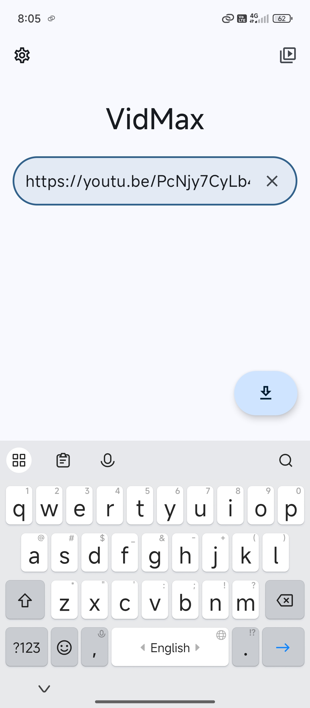
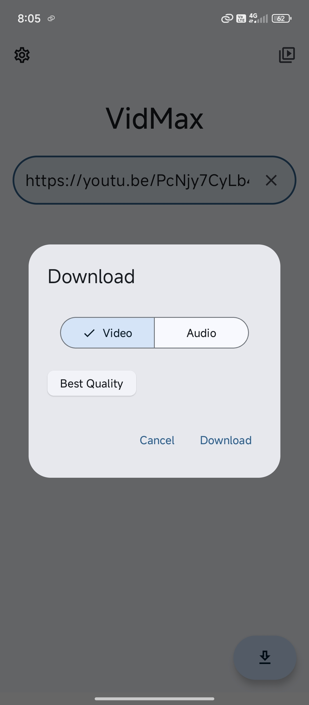

# VidMax 🚀

A simple Android application for downloading videos from various sources using [yt-dlp](https://github.com/yt-dlp/yt-dlp) via [youtubedl-android](https://github.com/yausername/youtubedl-android).

---

### ✨ Key Features

* **Download:** Download videos from URLs or directly via the "Share" menu from other apps.
* **Format Options:** Choose to download videos in a specific quality or audio-only (MP3).
* **Background Processing:** Downloads continue even if the app is closed, complete with progress notifications.

### 🛠️ Technologies Used

* [Kotlin](https://kotlinlang.org/)
* [Jetpack Compose](https://developer.android.com/jetpack/compose)
* [youtubedl-android](https://github.com/yausername/youtubedl-android)
* [Material 3](https://m3.material.io/)

### License

See the `LICENSE` file for more details.